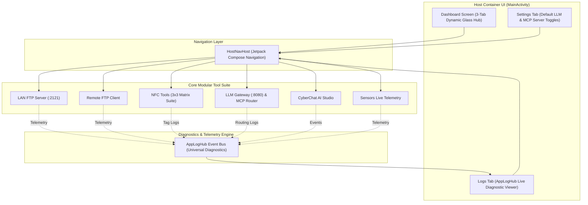
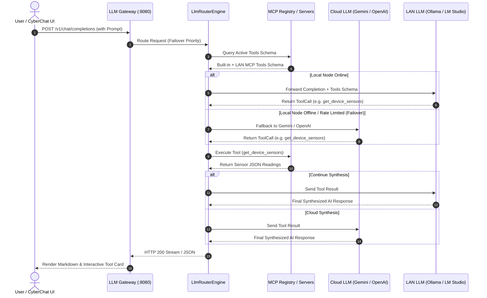
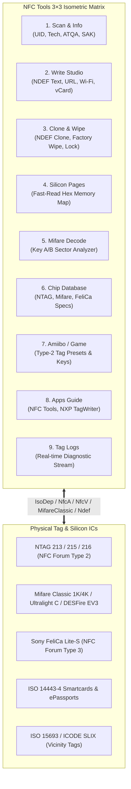

# MotherOfAllApps (MOAA) ⚡🛠️

> **A high-performance, modular Android utility and developer suite featuring an embedded LAN FTP Server & Remote Client, full-spectrum 3×3 NFC Tools Studio, Local LLM Gateway & MCP Router, CyberChat AI, real-time Sensor Telemetry, and a centralized System Log Hub.**

---

[-3DDC84.svg?logo=android&logoColor=white)](https://developer.android.com)
[](https://kotlinlang.org)
[](https://developer.android.com/jetpack/compose)
[](.github/workflows/release.yml)
[](#-application-architecture)
[](LICENSE)

---

## 📖 Table of Contents
- [Overview](#-overview)
- [Application Architecture](#-application-architecture)
  - [System Flow & Component Diagram](#system-flow--component-diagram)
  - [LLM Gateway & MCP Tool Loopback Architecture](#llm-gateway--mcp-tool-loopback-architecture)
  - [NFC Tools 3×3 Matrix & IC Protocol Stack](#nfc-tools-33-matrix--ic-protocol-stack)
- [Core Tool Suite](#-core-tool-suite)
  - [1. LAN FTP Server](#1-lan-ftp-server)
  - [2. Remote FTP Client](#2-remote-ftp-client)
  - [3. NFC Tools Studio (3×3 Suite)](#3-nfc-tools-studio-33-suite)
  - [4. Local LLM Gateway & MCP Proxy](#4-local-llm-gateway--mcp-proxy)
  - [5. CyberChat AI Studio](#5-cyberchat-ai-studio)
  - [6. Sensors Live & Hardware Telemetry](#6-sensors-live--hardware-telemetry)
  - [7. Centralized System Log Hub](#7-centralized-system-log-hub)
- [Developer Guide & Productivity](#-developer-guide--productivity)
  - [Adding a New Tool Plugin](#adding-a-new-tool-plugin)
  - [Using the LLM Gateway Loopback API](#using-the-llm-gateway-loopback-api)
  - [Logging with AppLogHub](#logging-with-apploghub)
  - [CI/CD Automated Releases](#cicd-automated-releases)
- [User Guide & Workflows](#-user-guide--workflows)
  - [Quick Start: Wi-Fi File Sharing](#quick-start-wi-fi-file-sharing)
  - [Quick Start: Connecting Desktop Ollama to CyberChat](#quick-start-connecting-desktop-ollama-to-cyberchat)
  - [Quick Start: Using NFC Tools](#quick-start-using-nfc-tools)
  - [Pinning Tools to Android Homescreen](#pinning-tools-to-android-homescreen)
- [Building & Testing](#-building--testing)
- [Security & Privacy](#-security--privacy)
- [License](#-license)

---

## 🌟 Overview

**MotherOfAllApps (MOAA)** is an all-in-one developer and power-user Swiss Army knife for Android. Built entirely on modern **Android 14+ (API 34–37)** foundations using **Jetpack Compose** and **Kotlin Coroutines/Flow**, MOAA provides robust offline-first utilities without third-party tracking, ads, or heavyweight cloud dependencies.

Whether you need to transfer large files wirelessly at gigabit LAN speeds, inspect NFC silicon memory pages, route LLM queries across local desktop nodes and cloud APIs with automatic failover and MCP tool calling, monitor physical hardware sensors at microsecond intervals, or debug background system events, MOAA consolidates these workflows into a single coherent system.

---

## 🏛️ Application Architecture

MOAA follows a **Modular Clean Architecture** separation of concerns, ensuring that individual tools remain completely decoupled from the host dashboard and from one another.

### System Flow & Component Diagram



---

### LLM Gateway & MCP Tool Loopback Architecture



---

### NFC Tools 3×3 Matrix & IC Protocol Stack



---

### Module Structure
```
mother_of_all_apps/
├── app/                                # Primary Android Application Module
│   └── src/main/java/dev/pritam/host/
│       ├── config/                     # Tool Registry metadata and definitions
│       ├── ftp/                        # RFC-compliant FTP Server engine & service
│       ├── host/                       # Host app state & tool loader
│       ├── logging/                    # AppLogHub diagnostic bus & retention pruner
│       ├── settings/                   # Global preferences & gateway controls
│       ├── shortcut/                   # Android Launcher Shortcut Manager
│       ├── tool/
│       │   ├── ftpclient/              # Remote FTP Client engine & session store
│       │   ├── llmchat/                # CyberChat AI UI, repository & personas
│       │   ├── llmgateway/             # Loopback HTTP server (8080) & router
│       │   ├── logviewer/              # System Logs UI & filters
│       │   ├── nfc/                    # NFC 3x3 Suite, NDEF, Memory Map & Sector Analyzer
│       │   └── sensors/                # Hardware sensor manager & sampling engine
│       └── ui/                         # Host Theme, Navigation, & Dashboard
└── plugin-api/                         # Lightweight interfaces for tool contracts
```

### Concurrency & Reactive State
- **State Management**: Every tool uses reactive `StateFlow` and `SharedFlow` primitives to ensure unidirectional data flow (UDF) between ViewModels and Compose screens.
- **Background Services**: Long-running network services (such as the LAN FTP Server and LLM Gateway Server) run in decoupled Android Foreground Services with persistent wake-locks and notification state controls.
- **Zero Third-Party Bloat**: Built cleanly with standard Android SDK, Jetpack libraries, and pure Kotlin serialization.

---

## 🧰 Core Tool Suite

### 1. LAN FTP Server
Host your Android device's internal and external storage directly over Local Area Network Wi-Fi.
- **High Concurrency Socket Engine**: Asynchronous multi-client socket listener built with Kotlin Coroutines (`Dispatchers.IO`).
- **Standard Protocol Support**: Implements `USER`, `PASS`, `PORT`, `PASV`, `LIST`, `MLSD`, `RETR`, `STOR`, `DELE`, `MKD`, `RMD`, `RNFR`, `RNTO`, and `SIZE`.
- **Configurable Authentication**: Set custom usernames, passwords, ports (default `2121`), and shared root directories (Downloads, Documents, or Full Storage).
- **Live Client Telemetry**: Real-time connected IP counter, active transfer throughput meter, and one-tap disconnects.

### 2. Remote FTP Client
Mount and interact with remote FTP servers directly from your phone.
- **Connection Profile Manager**: Securely bookmark remote FTP servers with stored hostnames, ports, credentials, and `PASSIVE`/`ACTIVE` mode toggles.
- **Remote File Manager**: Browse remote directories with breadcrumb navigation, create/delete directories, rename files, and upload/download with transfer queues.
- **Full Operational Logging**: File transfer starts, completions, and errors are automatically broadcast to **System Logs**.

### 3. NFC Tools Studio (3×3 Suite)
Comprehensive contactless RFID/NFC diagnosis and payload creation toolkit organized in a 3×3 matrix grid:
- 🔍 **Scan & Info**: Tag hardware UID, RF technologies (NfcA, IsoDep, Ndef), ATQA, SAK, and memory capacity inspection.
- ✍️ **Write Studio**: Compose and write standard NDEF records: Text/Markdown, Web URLs, Wi-Fi Network Credentials (WPA2/WPA3), vCard Contacts, and Android App Launchers (AAR).
- 🧬 **Clone & Wipe**: Clone NDEF payload payloads to write cache, format/wipe tags to factory clean state, and apply permanent read-only lock protection.
- 🗄️ **Silicon Pages**: Fast-read raw hex memory page browser with byte ASCII mapping and ASCII preview.
- 🔐 **Mifare Decode**: Sector trailer and data block analyzer for Mifare Classic (1K/4K) using standard Key A/B keys.
- 📚 **Chip Database**: Reference datasheets and specs for NTAG213/215/216, Mifare Classic, Mifare Ultralight C, Mifare DESFire EV3, Sony FeliCa Lite-S, and NXP ICODE SLIX.
- 🎮 **Amiibo / Game**: Preset guides, page layout definitions, and key slot specifications for Type-2 NTAG215 game accessories.
- 📱 **Apps Guide**: Curated companion apps recommendations (NFC Tools by wakdev, NXP TagWriter, NXP TagInfo).
- 📜 **Tag Logs**: Real-time diagnostic event stream with one-tap clipboard export.

### 4. Local LLM Gateway & MCP Proxy
An embedded loopback proxy server running on `http://127.0.0.1:8080` that unifies cloud LLM accounts and desktop local LLM engines.
- **OpenAI-Compatible REST API**:
  - `POST /v1/chat/completions` (JSON responses & SSE chunked streaming)
  - `GET /v1/models`
  - `GET /v1/gateway/status` & `GET /v1/gateway/profiles`
  - `GET /v1/mcp/servers`, `POST /v1/mcp/servers`, `GET /v1/mcp/tools`, `POST /v1/mcp/tools/call`
- **Model Context Protocol (MCP) Tool Integration**:
  - **Built-in Device Tools**: Query live device hardware sensors (`get_device_sensors`), check FTP server status (`get_ftp_server_status`), query system logs (`query_system_logs`), retrieve gateway health metrics (`get_gateway_status`), and compute math expressions (`calculate_math_expression`).
  - **Remote / LAN MCP Servers**: Connect to remote JSON-RPC 2.0 / SSE MCP servers running on your LAN or desktop with customizable authentication headers.
  - **Automated Tool Execution Loop**: `LlmRouterEngine` injects active MCP tools into completion requests for Gemini and OpenAI/Ollama, detects tool call requests, invokes the target MCP tool, and returns the computed results back to the LLM automatically.
  - **Interactive Schema Inspector & Test Runner**: Discover, inspect JSON Schema definitions, and test-run individual tools directly in the UI.
- **Hybrid Provider Routing**:
  - **Cloud Accounts**: Google Gemini (Pro/Flash via OAuth or API Key), OpenAI ChatGPT (OAuth or API Key).
  - **Desktop LAN Nodes**: Ollama (`:11434`), LM Studio (`:1234`), vLLM / LocalAI (`:8000`).
- **Zero-Downtime Smart Failover**: If a desktop machine is offline or a cloud account hits rate limits (`HTTP 429`), requests automatically failover to the next available provider in your priority sequence without dropping the user's connection.
- **Subnet Scanner**: One-tap LAN scanner that sweeps the local subnet (`/24`) to automatically discover active Ollama/LM Studio servers.

### 5. CyberChat AI Studio
Interactive conversational AI interface powered by the local LLM Gateway.
- **MCP Tool Calling & Interactive Accordions**: When an LLM invokes an MCP tool, CyberChat renders collapsible interactive tool invocation cards displaying arguments, status, and JSON outputs directly in the chat bubble.
- **Multi-Session Thread Manager**: Organize multiple independent chat threads with persistent local JSON storage.
- **AI Persona Presets**:
  - ⚡ **Code Architect**: Senior Kotlin & Android Clean Architecture engineer (temp `0.2`).
  - 🔮 **Cyberpunk Operator**: Network security & cryptography netrunner (temp `0.8`).
  - 📡 **Hardware Specialist**: Mobile sensor telemetry & NFC protocol expert (temp `0.4`).
  - ✨ **Creative Muse**: Brainstorming & copy ideation (temp `0.9`).
  - 🤖 **General Assistant**: Balanced everyday helper (temp `0.7`).
- **Markdown & Monospace Code Blocks**: Syntax-highlighted code blocks with 1-click **Copy Code** action.
- **Failover Badges & Latency Meters**: Inspect exact model used, response latency, and failover paths taken for each generation.

### 6. Sensors Live & Hardware Telemetry
Real-time physical sensor inspection and dynamic hardware monitoring.
- **Sensor Discovery**: Automatically enumerates all hardware sensors on the device (Accelerometer, Gyroscope, Magnetometer, Barometer, Light, Proximity, Temperature, Step Counter, Orientation, etc.).
- **Dynamic Live Sampling**: Switch between `1s`, `2s`, `5s`, `Fast (Live)`, or `Paused` sampling rates at runtime with event throttling.
- **Vector Decomposition**: Live 3-axis readings ($X, Y, Z$) with standard SI physical units (`m/s²`, `rad/s`, `µT`, `lx`, `hPa`, `°C`).
- **Telemetry Export**: Copy full sensor snapshots to clipboard formatted as Markdown or JSON for diagnostics.

### 7. Centralized System Log Hub
Universal diagnostic bus for the entire application.
- **Cross-Tool Stream**: Aggregates operations from FTP Server, FTP Client, NFC Tools, LLM Gateway, and Sensors.
- **Multiselect Filtering**: Filter logs by severity (`VERBOSE`, `DEBUG`, `INFO`, `WARN`, `ERROR`) and originating tool ID.
- **Highlighted Badging**: Highlights file paths, NFC payloads, raw hex data, and connection events.
- **Memory Retention Policies**: Configurable auto-purge window (1 Hour, 1 Day, 1 Week, 1 Month, or Unlimited).

---

## 🚀 Developer Guide & Productivity

### Adding a New Tool Plugin
All tools in MOAA are statically defined in `ToolRegistryConfig.kt` and routed through `HostNavHost.kt`. To add a new tool:

1. **Define the Tool Metadata** in `dev/pritam/host/config/ToolRegistryConfig.kt`:
```kotlin
ToolDefinition(
    id = "my-custom-tool",
    name = "Custom Analyzer",
    shortTagline = "Inspect network packets and local sockets.",
    description = "Detailed description of tool capabilities.",
    version = "1.0.0",
    category = "Networking",
    author = "Your Name",
    iconType = "generic", // Custom canvas icon in ToolIsometricIcon
    accentColorHex = 0xFF38BDF8,
    requiredPermissions = listOf("INTERNET")
)
```

2. **Add the Navigation Route** in `dev/pritam/host/ui/navigation/HostNavHost.kt`:
```kotlin
object HostRoutes {
    const val MY_CUSTOM_TOOL = "my_custom_tool"
}

// Inside HostNavHost NavHost:
composable(HostRoutes.MY_CUSTOM_TOOL) {
    MyCustomToolScreen(onNavigateBack = { navController.popBackStack() })
}
```

3. **Register Dashboard Click Dispatch** in `DashboardScreen.kt` and `HostNavHost.kt`.

---

### Using the LLM Gateway Loopback API
Any tool inside MOAA or external script running on the device can interact with the LLM Gateway loopback proxy at `http://127.0.0.1:8080`.

#### Example: Chat Completion Request via cURL / HTTP
```bash
curl -X POST http://127.0.0.1:8080/v1/chat/completions \
  -H "Content-Type: application/json" \
  -d '{
    "model": "default",
    "messages": [
      {"role": "system", "content": "You are a concise assistant."},
      {"role": "user", "content": "Explain Kotlin Flow in two sentences."}
    ],
    "temperature": 0.7,
    "stream": false
  }'
```

#### Example: Streaming Response via SSE
Set `"stream": true` in the request body to receive standard `data: { ... }` Server-Sent Events (SSE).

---

### Logging with AppLogHub
Log system operations and user actions into the centralized **System Logs** hub:
```kotlin
import dev.pritam.host.logging.AppLogHub
import dev.pritam.host.logging.LogLevel

AppLogHub.log(
    toolId = "my-custom-tool",
    toolName = "Custom Analyzer",
    level = LogLevel.INFO,
    tag = "SOCKET_CONNECT",
    message = "Connected to host 192.168.1.100 on port 8080"
)
```

---

### CI/CD Automated Releases
MOAA includes a fully automated GitHub Actions pipeline ([.github/workflows/release.yml](.github/workflows/release.yml)).
- **Trigger**: Every push to the `main` branch.
- **Pipeline Actions**:
  1. Sets up JDK 17 & Gradle build caching.
  2. Executes unit test suites (`./gradlew testDebugUnitTest`).
  3. Builds Debug and Release APK binaries (`./gradlew assembleDebug assembleRelease`).
  4. Automatically publishes a new GitHub Release with attached downloadable `.apk` files tagged by build number (e.g. `v0.1.0-r12`).

---

## 📱 User Guide & Workflows

### Quick Start: Wi-Fi File Sharing
1. Connect your phone to the same Wi-Fi network as your PC or Mac.
2. Open **LAN FTP Server** from the dashboard.
3. Verify your username and password (or use default credentials).
4. Tap **Start FTP Server**.
5. On your computer:
   - **Windows File Explorer**: In the address bar, type `ftp://<PHONE_IP>:2121` and log in.
   - **macOS Finder**: Press `Cmd + K`, enter `ftp://<PHONE_IP>:2121`, and connect.
   - **FileZilla / Cyberduck**: Host: `<PHONE_IP>`, Port: `2121`, Protocol: `FTP`.

### Quick Start: Connecting Desktop Ollama to CyberChat
1. On your desktop running Ollama, ensure it listens on your local LAN (`OLLAMA_HOST=0.0.0.0:11434 ollama serve`).
2. Open **LLM Gateway** on MOAA.
3. Tap **Discover LAN Hosts** or manually add a host with `http://<DESKTOP_IP>:11434`.
4. Open **CyberChat AI** from the dashboard and start chatting. If your desktop goes to sleep, the Gateway automatically falls back to your configured cloud account.

### Quick Start: Using NFC Tools
1. Open **NFC Tools** from the dashboard.
2. Select any tile from the **3×3 Matrix**:
   - **Scan & Info**: Hold a physical tag near the back of the device to read UID, tech type, and NDEF messages.
   - **Write Studio**: Select a payload type (e.g., *Wi-Fi Network* or *URL*), input details, tap **Prepare Write**, and hold the tag to program.
   - **Clone & Wipe**: Clone scanned payloads, wipe to blank NDEF, or lock.
   - **Silicon Pages & Mifare Decode**: Inspect raw page memory and sector keys.
   - **Chip Database & Amiibo Presets**: Browse datasheets and game memory layouts.

### Pinning Tools to Android Homescreen
1. On the **Dashboard**, find the tool you use frequently (e.g., *CyberChat AI* or *Sensors Live*).
2. Tap the **Pin Shortcut** icon on the tool card.
3. Confirm the system prompt.
4. Launching the shortcut from your home screen opens the tool directly, bypassing the dashboard.

---

## 🛠️ Building & Testing

### Prerequisites
- Android Studio Ladybug / Meerkat (or IntelliJ IDEA with Android plugin)
- JDK 17 or JDK 21
- Android SDK 34+ (compileSdk 37)

### Build Commands
```bash
# Clone the repository
git clone https://github.com/pritamprasd/mother_of_all_apps.git
cd mother_of_all_apps

# Run all unit tests
./gradlew testDebugUnitTest

# Build Debug APK
./gradlew assembleDebug

# Build Release APK
./gradlew assembleRelease
```

Generated APK paths:
- Debug: `app/build/outputs/apk/debug/app-debug.apk`
- Release (Unsigned): `app/build/outputs/apk/release/app-release-unsigned.apk`

---

## 🔒 Security & Privacy

- **Zero Analytics & Tracking**: No external telemetry, crash reporters, or behavioral analytics SDKs.
- **Local Data Storage**: All chat threads, connection profiles, and credentials remain strictly stored in local sandboxed storage on the device.
- **Network Boundaries**: The LLM Gateway loopback proxy only binds to `127.0.0.1` and does not expose open ports to the WAN.

---

## 📄 License

```
Copyright 2026 MotherOfAllApps Contributors

Licensed under the Apache License, Version 2.0 (the "License");
you may not use this file except in compliance with the License.
You may obtain a copy of the License at

    http://www.apache.org/licenses/LICENSE-2.0

Unless required by applicable law or agreed to in writing, software
distributed under the License is distributed on an "AS IS" BASIS,
WITHOUT WARRANTIES OR CONDITIONS OF ANY KIND, either express or implied.
See the License for the specific language governing permissions and
limitations under the License.
```
