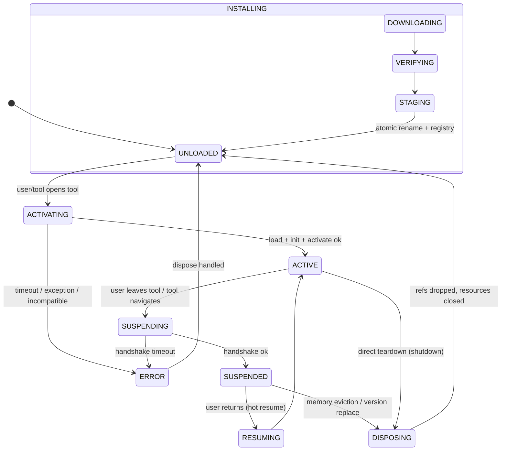
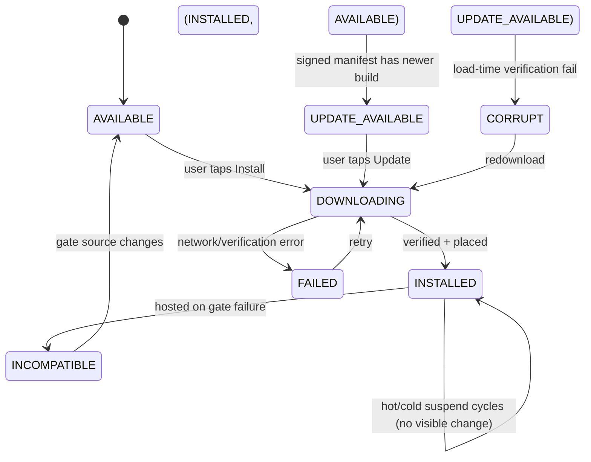
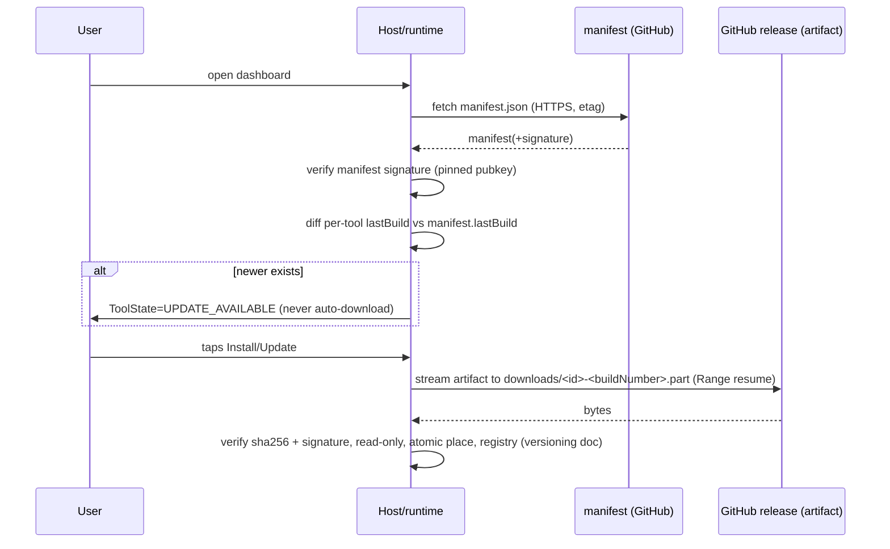

# Plugin Runtime Design

Status: **DESIGNED** (no implementation yet).

The `plugin-runtime` module will sit between `app` and `plugin-api`
(ADR-011/architecture.md §2). It owns download, verification, loading, lifecycle,
suspension, persistence, version management driver, failure handling, and memory
control. It interacts with the host only through `HostAppState` (catalog
`StateFlow`) and a small runtime coordinator.

Companion documents: artifact format `docs/plugin-artifact.md`, contract
`docs/plugin-api.md`, versioning `docs/plugin-versioning.md`, security
`docs/plugin-security.md`, performance `docs/performance.md`.

---

## 1. Module & component map

```
app  (host UI, HostApplicationContainer, HostAppState)
 │   owns: navigation routes, dashboard, active-tool route
 ▼
plugin-runtime
 ├── Catalog / Registry service     # DataStore: what is known+installed (host-state)
 ├── Repository (GitHub client)     # fetch signed manifest; no code trusts network bytes
 ├── Verifier                      # crypto + hash + container checks (read-only), FileScope policy
 ├── Downloader                    # resumable .part streaming, budget checks
 ├── Installer                     # unpack → v<N>.tmp → verify → read-only → atomic rename → registry
 ├── Loader                        # DexClassLoader + ResourcesProvider + context, single live session
 ├── LifecycleManager              # state machine (§5), budgets, disposal
 ├── PersistenceStore              # FileScope layout + atomic section writes + recovery
 ├── MemoryController              # LRU/eviction, reference discipline (§12)
 └── HostBridge                    # feeds HostAppState; drains HostApplicationContainer events
```

Dependency direction: `app → plugin-runtime → plugin-api[(+ plugin-rendering)]`.
Plugins depend on `plugin-api`/`plugin-rendering` only (never on runtime/app).

## 2. Loading mechanism (requirement "plugin loading")

### 2.1 Classloader

- Per-installed-version **`DexClassLoader`** created lazily at activation:
  - `dexPath` = colon-joined **raw `.dex` files** extracted from the artifact
    (`v<N>/dex/classes.dex`, …). Rationale: `BaseDexClassLoader` documents that
    jar/apk entries in `dexPath` may be extracted **in-memory** before loading;
    passing raw dex avoids materializing a large container in RAM at load time
    (large-artifact requirement 21). The APK/JAR container remains on disk and is
    still the resource source via `ResourcesProvider`.
  - `optimizedDirectory` = `null` (deprecated, no effect since API 26).
  - `librarySearchPath` = extracted native dir when native libs exist (FUTURE).
  - `parent` = host `PathClassLoader` (the app's loader) → **parent-first
    delegation** with a shared-library whitelist (below).
- `PathClassLoader` itself is **not** used for plugins: it is intended for
  already-installed app-dex (the app's own loader). `DexClassLoader` is the
  documented mechanism for executing code not installed as part of the app.
  Reference: https://developer.android.com/reference/dalvik/system/DexClassLoader

### 2.2 Classloader isolation

```
BootClassLoader                     (framework classes: java.*, android.* core)
└── Host PathClassLoader            (app classes: host + shared whitelist libs)
   │                                (kotlin-stdlib, kotlinx-coroutines, Compose runtime,
    │                                androidx.*core, plugin-api, plugin-rendering)
   └── ToolClassLoader (per version per tool)    ← owns plugin-specific classes only
```

Properties:

- **Parent-first** with a whitelist: plugin code referencing a shared library
  (Compose runtime, kotlinx, plugin-api) resolves against the host's copy — one
  instance, no class identity split between host and plugin.
- Plugin-private classes (its business logic, private dependencies not on the
  whitelist) resolve only in `ToolClassLoader`, so two tool versions never share
  class identity. This is the isolation that makes per-version clean replacement
  possible at the **reference** level.
- The **whitelist is closed on both sides**:
  - Host ships only whitelisted shared classes on the parent.
  - Plugin must not bundle classes that shadow whitelisted packages/namespaces
    (compile-time lint + load-time class-name collision detection leading to
    `INCOMPATIBLE`).

### 2.3 Resource loading

- Resources are loaded with the **public** API (API 30+, `android.content.res.loader.*`):
  `ResourcesProvider.loadFromApk(ParcelFileDescriptor)` parked on a
  `ResourcesLoader`, attached to the plugin composable via a scoped
  `Resources`/Asset exposure. A **file descriptor** keeps the container
  read-only, satisfying Android 14 safer-DCL.
- Resource lookups go plugin-first with a host fallback; resource **IDs** are
  resolved at load time (`.arsc`), so the plugin code never hard-codes host R
  ints and the host never exposes R classes to the plugin.
- `ResourcesProvider.close()` frees the internal ApkAssets; the host calls it
  on disposal so resource memory is released with the session.

### 2.4 Context handling

- Plugins get **no Android `Context`** (contract §9). The runtime constructs a
  minimal `PluginContext`/`PluginSession` (contract §§3.3–3.4). No
  `ContextWrapper`, no `packageName` spoofing, no activity forwarding. This
  removes an entire class of plugin/host coupling and the classic
  container-context bugs.

### 2.5 Class unloading — the honest statement

ART **does not guarantee class unloading**. Observable reality:

- A `ClassLoader` and its classes become collectible only when **no strong
  references** remain to them and the GC runs; it is best-effort, not
  deterministic, and can be influenced by ART internals (type registry, runtime
  metadata, coroutine thread stacks, JIT/oat state).
- Native libraries loaded via `System.load`/`loadLibrary` are **not unloadable**
  without killing the process (Android's linker keeps namespaces/handles for the
  process lifetime).
- Therefore: the runtime provides **reference-level disposal** (drop every host
  root to the tool's classes, instances, classloader, resources provider,
  coroutines, executor, and listeners) and **documents the memory being freed as
  "eligible", not "guaranteed freed"**. Verdicts:
  - "Unloaded" == "no live references; eligible for collection". Never claimed as
    deterministic frees (ADR-008).
  - Native-bearing tools are process-scoped once activated (see
    `docs/plugin-artifact.md` §7).

### 2.6 Android security restrictions that shape the design

- **Android 14+ safer DCL**: every dynamically loaded file must be read-only or
  the system throws (`ENFORCE_READ_ONLY_JAVA_DCL`, Change ID `218865702`).
  Enforced by the Installer (`plugin-artifact.md` §10).
- **Zip path traversal** (Android 14+): `ZipFile`/`ZipInputStream` reject
  entries with `..` or leading `/`. The Installer additionally validates entry
  names before extraction.
- Timed/verified installs: no code in this design depends on hidden APIs or
  unsupported `@UnsupportedAppUsage` paths (the reflective
  `AssetManager.addAssetPath` approach is explicitly rejected, `plugin-artifact.md` §2.4).

### 2.7 Future native loading

Designed in `plugin-artifact.md` §7: extract `lib/<abi>/` to
`v<N>/native/<abi>/`, pass as `librarySearchPath`, ABI-filter by
`Build.SUPPORTED_ABIS`, 16 KB-aligned requirement, process-scoped lifetime.

---

## 3. Activation pipeline

```mermaid
flowchart LR
    A[registry: CURRENT vN] --> B[Verifier: hash+signature]
    B --> C[Loader: extract raw dex, read-only]
    C --> D[ToolClassLoader created]
    D --> E[ResourcesProvider(fd) + loader]
    E --> F[instantiate ToolPlugin]
    F --> G[onInitialize within budget]
    G --> H[onRestore persistence]
    H --> I[onActivate -> ToolRendering]
    I --> J[ACTIVE: composed into NavHost route]
```

All steps off the main thread except the final composition hand-off. Budgets and
timeouts in `docs/performance.md`; failure rules in §8.

---

## 4. Lifecycle state machine (requirement 3)

Two layered machines, because persistence granularity differs:

- **Persisted `ToolState`** (catalog/dashboard-visible; `plugin-api.md` §7).
- **Runtime `PluginLifecycle`** (in-memory; per session; stricter).



Notes:

- `UNLOADED` == referenced by nothing; eligible for collection. This is the
  reload-from-disk resting state.
- `SUSPENDED` keeps the classloader + plugin object (fast `RESUMING`), but all
  **heavy** references (composition, images, executor tasks, resources provider,
  coroutine scopes) are already released. Choosing SUSPENDED vs straight-to-UNLOADED
  is a per-tool LRU policy (memory model §12).
- `INACTIVE` is intentionally **not** a state: a tool is either ACTIVE, transient
  (SUSPENDING/RESUMING), or inactive-with-refs-released (SUSPENDED/UNLOADED).
- Persistence runs as a **cross-cutting** transition that can be scheduled from
  any of ACTIVING/ACTIVE/SUSPENDING/SUSPENDED (`PERSISTING` overlays); it never
  blocks the main thread.

Persisted `ToolState` mapping:



## 5. Version management driver

The runtime drives the CURRENT/STAGED/AVAILABLE/FAILED machine defined in
`docs/plugin-versioning.md`. Its only responsibilities here:

- background check against the signed manifest (async, non-blocking, §9);
- explicit user-triggered downloads (§9);
- rollback on activation failure (§8) via `LifecycleManager`:
  retry CURRENT; on success, STAGED is demoted to FAILED-SUPERSEDED and cleaned.

---

## 6. Host/plugin API + Android compatibility gate (req 18, 22)

Evaluation order at install time and again at activation time:

```
1. artifact plugin.json present & sha-consistent        (plugin-runtime/Verifier)
2. signed manifest buildNumber == artifact buildNumber  (Verifier)
3. requiresPluginApi ⊇ host.contract                    (HostEnvironment)
4. requiresHostVersion.min ≤ host version               (HostEnvironment)
5. requiresAndroidSdk ∩ Build.VERSION.SDK_INT non-empty
6. ABI filter (native tools): requiresAndroidSdk passed; abi ∩ SUPPORTED_ABIS
7. shared-library whitelist shadow check                (Loader)
```

All gate failures ⇒ `INCOMPATIBLE` (catalog) + `ERROR` (lifecycle), no activation.
Gate data comes from the **signed manifest**, never from bare network metadata.

---

## 7. Process death & recovery (requirements 6, 9)

```mermaid
sequenceDiagram
    participant OS as Android
    participant R as Runtime(onCreate start)
    participant L as Loader/Session

    Note over OS: kills process at any instant
    OS->>R: process start (MainActivity)
    R->>R: read registry (DataStore)
    R->>R: reconcile registry vs v<N> dirs
    alt registry says CURRENT vN, dir missing
        R->>R: vN lost → repair: fall back STAGED; else FAILED→redownload prompt
    else orphan v<N>.tmp found
        R->>R: delete orphan tmp; resume install if .part exists
    end
    R->>R: restore host-state (last active tool)
    R->>R: verify artifact still pass (hash/signature) BEFORE load
    L->>L: onRestore(persistence) → onActivate → ACTIVE
    OS->>R: user sees exact tool again
```

Invariants make the tool **fully reconstructable from disk** (req 6):

- `host-state.json` records last-active tool + version + suspend timestamp.
- All plugin recoverable state lives in `state/` (`plugin-api.md` §4) and is the
  **only** input to `onRestore`. No in-memory data is ever semantically required.
- Artifacts are immutable + hashed; the loader re-verifies before load (cheap
  streaming hash) so a partially-written/corrupted `v<N>` can never be activated
  (corrupt⇒redownload).
- Torn-write safety from atomic section renames; torn branch repaired above.

## 8. Failure model (requirement 11)

Behavior per failure mode. All user-visible outcomes are expressed through
`ToolState` so the dashboard renders repair actions; all are non-blocking.

| Failure | Detection | Behavior |
| --- | --- | --- |
| No internet | download/check exception (IOException/DNS) | ToolState unchanged; dashboard shows "offline" hint; cache remains usable (offline operation after download, a stated requirement). No retry storm (exponential backoff + on-connectivity hook). |
| Slow internet | progress + stalled-transfer timeout | Progress surfaced; stalled > threshold ⇒ abort & resume on retry (Range). Non-blocking. |
| GitHub unavailable | HTTP 5xx/timeout on manifest/artifact | Same as no internet; manifest cached from last successful check remains valid for a TTL (stale-data policy in §9). |
| Partially downloaded artifact | size mismatch / stream end before advertised length | Resume via Range or full restart; `.part` never activates. |
| Corrupt artifact | sha-256 mismatch at install or load | Mark CURRENT corrupt ⇒ try redownload; keep last known-good version as fallback; `CORRUPT` state. |
| Invalid signature | crypto verify fail | Hard reject; `CORRUPT`; never loads; logged; manifest/keys suspect ⇒ surface error. |
| Incompatible host version | gate §6 | `INCOMPATIBLE`; do not offer install/update. |
| Incompatible Android | gate §6 item 5 | Same as above. |
| Insufficient storage | `IOException` ENOSPC while writing | Abort download/install; delete `.tmp`; dashboard warning; size estimate from manifest shown before download. |
| Process death during install | registry vs dirs reconcile (§7) | Orphan `.tmp` removed; `.part` resumed; no half-installed state ever activates. |
| Process death during activation | crash mid-load | On next start the artifact version stays `INSTALLED`; the session is simply not resumed and `host-state` last-active is re-activated lazily on user open. No corruption possible (load is idempotent; artifacts immutable). |
| Plugin crash (uncaught) | Thread death / `UncaughtExceptionHandler` boundary | Host catches at session boundary; tool → `FAILED` w/ session reset; user **not** force-killed; host remains stable. Documented: a truly fatal native crash still kills the process (Android cannot catch SIGSEGV) — acceptable and stated. |
| Plugin initialization timeout | activation budget exceeded | Abort; attempt CURRENT rollback if upgrading; `FAILED`; retry allowed. |

Explicit policy: the **host never soft-crashes** because of a tool. Every plugin
call crosses a guarded harness; every worker is a tool-session worker.

## 9. GitHub infrastructure protocol (requirement "GitHub infra")

### 9.1 Source of truth shape

A dedicated repository (e.g. `mother-of-all-apps-tools/manifest`) checked in
with a machine-readable manifest; per-tool artifacts are GitHub **Releases**
in that repo or per-tool repos.

```
manifest repo:  /manifest/main/manifest.json     (fetched via raw.githubusercontent.com, HTTPS)
tool releases:  /releases/download/tool-<id>-<buildNumber>/tool-<id>-<buildNumber>.tpack
                + .sha256 sidecar (belt-and-suspenders; hash already in manifest)
```

### 9.2 Manifest format (signed, §security)

```json
{
  "manifestVersion": 1,
  "generatedAtUtc": "2026-09-13T00:00:00Z",
  "host": { "min": "0.1.0", "max": null },
  "tools": [
    {
      "toolId": "image-resizer",
      "displayName": "Image Resizer",
      "description": "...",
      "lastBuild": 42,
      "versions": [
        {
          "buildNumber": 42,
          "displayVersion": "1.7.2",
          "artifactUrl": "https://github.com/<owner>/<repo>/releases/download/tool-image-resizer-42/tool-image-resizer-42.tpack",
          "sha256": "9f86d0…",
          "sizeBytes": 4821337,
          "requiresPluginApi": { "min": 1, "max": 1 },
          "requiresHostVersion": { "min": "0.1.0" },
          "requiresAndroidSdk": { "min": 34, "max": 37 },
          "abi": ["arm64-v8a", "x86_64"]
        }
      ],
      "signature": "base64url(ECDSA-P256-SHA256(sha256(canonicalToolRecord)))"
    }
  ],
  "signature": "base64url(ECDSA-P256-SHA256(sha256(canonicalManifest)))"
}
```

- **Canonicalization**: stable JSON serialization (sorted keys, no incidental
  whitespace) — defines exactly what is signed.
- **Belt-and-suspenders**: manifest signature (authenticity of the whole list)
  and per-tool signature (so a single compromised tool record can be invalidated
  without reissuing the entire manifest).

### 9.3 Discovery & update flow



- **Check cadence**: on foreground + ≤ every 6 h; never part of critical startup;
  silent failure offline.
- **User-triggered downloads only** (ADR-008): background checks never download.

### 9.4 Why GitHub is enough

- Releases serve immutable, hashable binaries over HTTPS with ETags/Content-Length.
- `raw.githubusercontent.com` serves our manifest with caching headers.
- No per-click auth needed for public repos; no API keys in the app.
- History/release notes are free; pinning is done **by key hash in the app**, not
  by checking tags.

## 10. Concurrency model

- Single **runtime dispatcher** (bounded, `Dispatchers.Default`-ish pool renamed
  host-scoped) for verification/install/load.
- **Persistence dispatcher** for section writes.
- **Tool session executor** (from `PluginContext.executor`) — created per session,
  cancelled at SUSPENDED/DISPOSED.
- UI thread touches only Compose composition + `HostAppState` emissions.
- All runtime ↔ host state traversal through `HostAppState` (`StateFlow`), so the
  dashboard is always consistent.

## 11. Performance pointers

Measurable targets live in `docs/performance.md`. Runtime-owned budgets:
activation, suspend, restore, install, background-check, per-key persistence.
No blocking I/O on main (ADR-008).

## 12. Memory model (requirement 12) — "one active tool at a time"

### 12.1 Reference discipline

Exactly **one** `SessionHandle` exists in the host at a time:

```
HostNavHost ──(activeToolRoute)──▶ ToolHost(composable slot)
   │                                    │
   └─ HostAppState.activeSession ─▶ SessionHandle (the ONLY strong ref)
                                      ├─ ToolClassLoader
                                      ├─ ToolPlugin instance
                                      ├─ ResourcesProvider + ResourcesLoader
                                      ├─ PluginSession (executor, FileScopes, metrics)
                                      ├─ CoroutineScope(session-bound)
                                      └─ state snapshot
```

Rules:

- Strong references to plugin types exist **only** reachable through the single
  `activeSession`. Dashboard/registry hold `ToolInfo` (data), never plugin objects.
- On `SUSPENDED_REFERENCE_DROP`: `HostAppState.activeSession` cleared,
  `dispose()` runs, and the `SessionHandle` is dropped; nothing else caches a
  plugin reference.
- Enforced structurally (the runtime is the only component permitted to touch
  plugin classes) — not by wishful GC (ADR-008).

### 12.2 Inventory of must-release items

| Item | Release mechanism |
| --- | --- |
| Strong refs (plugin/classloader/SessionHandle) | drop `activeSession`; only-once ownership |
| Coroutine scopes | `scope.cancel()` in DISPOSING; session executor shut down |
| Image cache | plugin-owned, session-scoped; dropped with session; budget-capped by MemoryController |
| ViewModels | plugins get none (contract §9); host ViewModels only for host UI |
| Compose compositions | the tool composable leaves the NavHost tree on suspend; Compose releases state |
| Listeners/callbacks | registered through session dispatcher; cleared on DISPOSING |
| Executors/threads | bounded, session-scoped, cancelled (never leaked threads) |
| Native resources | cannot be unloaded mid-process (documented, §2.5 / artifact §7) |
| Resources (ApkAssets) | `ResourcesProvider.close()` in DISPOSING |

### 12.3 "Inactive" definition

A tool is **inactive** when exactly one of:

- `SUSPENDED`: object + classloader retained, all heavy/host-rooted refs released;
  resume is cheap; eligible for eviction.
- `UNLOADED`: nothing referenced; eligible for collection; reload = cold.

`SUSPENDED → UNLOADED` is driven by `MemoryController` LRU + `onTrimMemory()`:
dashboards reclaim the last `SUSPENDED` tool under pressure. One ACTIVE tool only
(ADR-008).

### 12.4 Memory budget (see docs/performance.md §memory)

`getMemoryClass()` budget split: host baseline, active tool, suspension reserve.
Oversight: SessionHandle carries a `ResourceBudget`; the plugin is told remaining
budget and cache is sized against it.

---

## 13. Verification matrix (uncertain Android behaviors)

The following are intentionally **not claimed as fact** in this design; each is a
named integration test against API 34..37 on the emulator matrix before the
runtime's first release:

1. Read-only enforcement boundaries (`v<N>` dir, raw dex, container fd).
2. Resource ID resolution through `ResourcesProvider` + `ResourcesLoader`.
3. Observable collection of a dropped tool classloader (profiled, not asserted).
4. Compose runtime parent/plugin ABI compatibility on BOM pin ranges.
5. Native lib load path + ABI filtering + 16 KB alignment on the installed image.