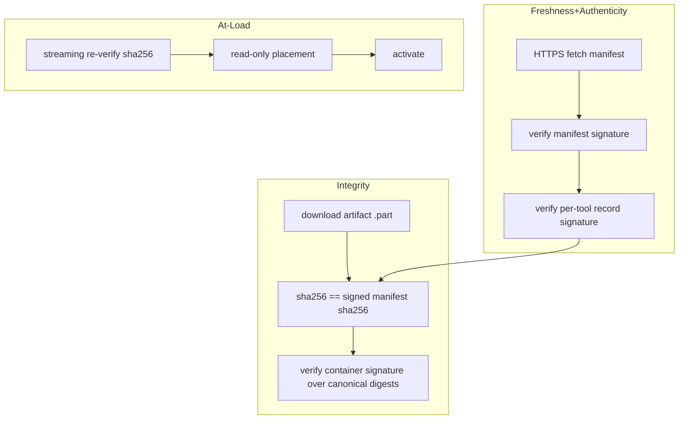

# Plugin Security

Status: **DESIGNED** (no implementation yet).

Cryptographic and trust design for downloading, verifying, and loading tool
artifacts. Companion: `docs/plugin-artifact.md` (container), `docs/plugin-runtime.md`
(protocol/verification pipeline), `docs/plugin-versioning.md` (machine).

---

## 1. Threat model

Assumed adversaries (a personal, sideloaded host; ADR-005):

| # | Threat | Example |
| --- | --- | --- |
| T1 | Network attacker | MITM swaps artifact/metadata on the wire |
| T2 | Repo/org compromise (release tampering) | Attacker edits a GitHub release or the manifest with write access |
| T3 | On-device tampering (post-download) | Rooted device or exploit modifies `v<N>` on disk |
| T4 | Malicious/compromised tool publisher | A tool's signing key is stolen; publisher account hijacked |
| T5 | Downgrade / confused-deputy | Old manifest replay or cross-tool artifact swap |

Goals: integrity (bytes unchanged), authenticity (issued by a trusted key holder),
offline verifiability, and surfacing of every failure as a state, never as
silently-loaded.

## 2. Cryptographic mechanism selected

**ECDSA P-256 (`SHA256withECDSA`)** for all signing/verification.

| Option | Verdict |
| --- | --- |
| Ed25519 | Preferred in abstract (small sig, constant-time) — but provider availability on the supported floor must be guaranteed. Conscrypt ships Ed25519 only from Android 12 (API 31). Our floor is API 34, so it would work — but we select the conservative universally-available provider instead (below) and revisit. |
| RSA-2048/3072 | Works everywhere; larger signatures, slower verify, legacy padding concerns. Rejected on size/performance. |
| ECDSA P-256 / SHA-256 | **Selected.** `Signature.getInstance("SHA256withECDSA")` + `KeyFactory` for pkcs8 SPKI is available through the platform `Conscrypt`/`AndroidKeyStore` providers on every supported device (API 34+); 64-byte signatures; fast verify. No external crypto library needed (ADR-007 smallest deps). |

Keys are **ECDSA P-256**; hashing is SHA-256 everywhere (manifest digests,
artifact sha256, content digests). Keys live as **SPKI public keys** pinned in
the host; private keys exist only in CI/publisher infrastructure (§5).

## 3. Layers verified



Every layer is independent, so a failure in any one of them yields a `CORRUPT` /
refusal rather than a load (failure model, `plugin-runtime.md` §8).

## 4. Why not APK signatures

Android's APK v2/v3 (or v1) signature schemes validate an installed package via
`PackageManager` — they are designed around package identity and install-time
signature rotation, and verifying them for an **uninstalled** APK requires
implementing the apksig scheme (large, version-churn prone) or using hidden APIs.
The container is not a package to the system at all. Our own detached signature
(`meta/signature.bin`) is:

- defined by us, stable, documented (artifact §5);
- verified with platform JCA (no apksig dependency);
- self-contained (offline verifiable).

Tradeoff accepted: we reimplement a simple canonicalized digest signature rather
than reuse the OS's package verifier. Payoff: no dependency on uninstalled-APK
parsing quirks and no hidden APIs.

## 5. Key management & where keys live

```
Signing keys (PRIVATE)                    Verification keys (PUBLIC)
├─ Publisher key ∘ tool signing           ├─ pinned in host (Kotlin resource/raw asset)
│    CI secrets / separate-purpose key     │    trusted store: [{keyId -> SPKI}]
├─ Manifest key ∘ release manifest         └─ updated only via host release
└─ (host release signing key: separate)       (repin = new host APK)
```

Rules:

- Private keys **never** enter the repository, the app, or any build artifact.
  They are injected into CI as encrypted secrets; a hardware security module or a
  separate signer container is the recommended housing as volumes grow.
- The host pins the **public keys** (one per active role: tool publisher,
  manifest author). Pinning in-app is the *source of authenticity* for everything
  below; there is no transitive trust.
- `keyId` (fingerprint, e.g. first 8 bytes of SHA-256 of SPKI) is carried in the
  signature blocks so a compromised/stale key can be distinguished when several
  are pinned.

## 6. Verification details

### 6.1 Manifest verification (freshness + record authenticity)

- Canonicalize (sorted keys, stable JSON) → SHA-256 → verify with manifest key
  over the whole document; verify each tool record with the tool's key.
- Replay protection: `generatedAtUtc` + host checks publication not older than
  TTL (offline reuse allowed within TTL; see §8).

### 6.2 Artifact verification (integrity + self-containment)

- `sha256(artifact bytes)` == field from signed manifest.
- Rebuild canonical digest block (`plugin-artifact.md` §5) from entries except
  `meta/signature.bin`; verify with the `keyId` recorded at signing.
- Streaming: both hashes computed in one pass; no full in-memory copy.

### 6.3 At load time

- Streaming SHA-256 re-verify; container used via read-only FD
  (`ResourcesProvider.loadFromApk(ParcelFileDescriptor)`); dex files read-only
  (`plugin-runtime.md` §2.6). Android 14 DCL enforcement is our ally, not an extra
  burden: we already finalize read-only at placement.

### 6.4 Read-only protection (requirement "read-only protection")

After placement, every file under `v<N>/` is `chmod 0444` (via the atomic rename
step on a read-only `v<N>.tmp`). The Android 14 policy extends the model: an
attacker who gains write access to our storage cannot silently modify a loaded
artifact because (a) files are read-only and (b) even a rewritten file would fail
the streaming re-verify. `host-state.json` (no code) is the only writable file in
the layout.

## 7. Cost & infrastructure classification (requirement "explain… free/infrastructure/…")

| Concern | Class | Notes |
| --- | --- | --- |
| ECDSA P-256 + SHA-256 crypto (verify) | **Free** | Platform JCA providers, no dependency, no license |
| HTTPS transport | **Free** | GitHub TLS built-in |
| Per-install verify compute | Free | one RSA-free P-256 verify + two streaming hashes |
| Key pair generation & custody | **Infrastructure** | CI secrets/SOPS/HSM; operational discipline |
| Private key protection (secret) | **Requires secret-key protection** | never in repo/app; least-privilege CI roles; rotation path |
| Signed manifest publishing | Infra | release CI signs canonical manifest each publish |
| Trust-store repinning | Infra | new host release carries new pinned keys |
| Revocation/compromise response | Infra+Vendor | found in §9 |

What is free today in practice (this app): all symmetric/verify operations, HTTPS,
GitHub. What costs: key custody (people/process), a tiny release-signing bot, and
the discipline of never mixing keys.

## 8. Manifest replay / downgrade / offline policy (T5)

- Host records `lastSeenManifestHash` + generation time. It accepts a manifest
  that is **newer or equal** (`generatedAtUtc`) to the recorded one.
- A replayed older manifest (equal hash is fine; older timestamp with different
  hash) is rejected, preventing rollback of `availableBuild` to a weaker version
  (downgrade protection at the *availability* level). The **activation** level is
  separately protected because artifact bytes are bound to buildNumber by hash.
- Offline: reuse last verified manifest within TTL (24 h) to show update badges;
  downloads are impossible offline anyway.

## 9. Key compromise handling (T4, "what happens if…")

If the tool signing key or the manifest key is compromised:

1. **Immediately** — cease signing with it; rotate to a newly generated key
   pair (CI secret rotation).
2. **Publish** a signed "revocation" notice (signed with the *old* compromised key
   cannot be trusted; a revoke entry must be carried by a separate resilient
   channel — in practice: ship a host update that **removes** the old keyId from
   the pinned set, or publish a new manifest signed by a still-trusted key that
   lists `revokedKeyIds`).
3. **Host update** — because trust is anchored in pinned public keys, the only
   true revocation primitive is a **repinned host**. The runtime supports multiple
   pinned keyIds so a host can carry both old (revoked) and new key while
   validating in a single release; revoked artifacts lose `CURRENT` only if their
   `keyId` is dropped.
4. **Audit** — identify which buildNumbers were signed with the compromised key;
   mark those versions `CORRUPT`/untrusted and force re-download of newer builds.

Because "trusted public keys" live in the app, compromise response is: *rotate
key + ship host update that repins*. This is a documented operational necessity,
not an unnoticed gap.

## 10. What the runtime refuses to do (non-negotiable)

- Never loads code that failed any of the three verification layers.
- Never loads over plaintext transport.
- Never accepts metadata from a bare URL (no signed manifest ⇒ no artifact).
- Never executes tool-supplied native code before ABI/gate validation, and never
  executes on API not covering the required SDK gate.
- Never exposes the host's private keys, token, or host internal classes to a
  plugin (whitelist enforcement, `plugin-runtime.md` §2.2).

## 11. Open verification-time uncertainties

- Provider behavior across OEM ROMs for `SHA256withECDSA` is treated as a
  **positive test** (instrumented test on API 34..37) — the algorithm is
  practically universal, but we never assume silently (`plugin-runtime.md` §13).
- Native-loaded artifacts carry additional integrity checks (hash each `.so`
  before dlopen) once native support ships (FUTURE).