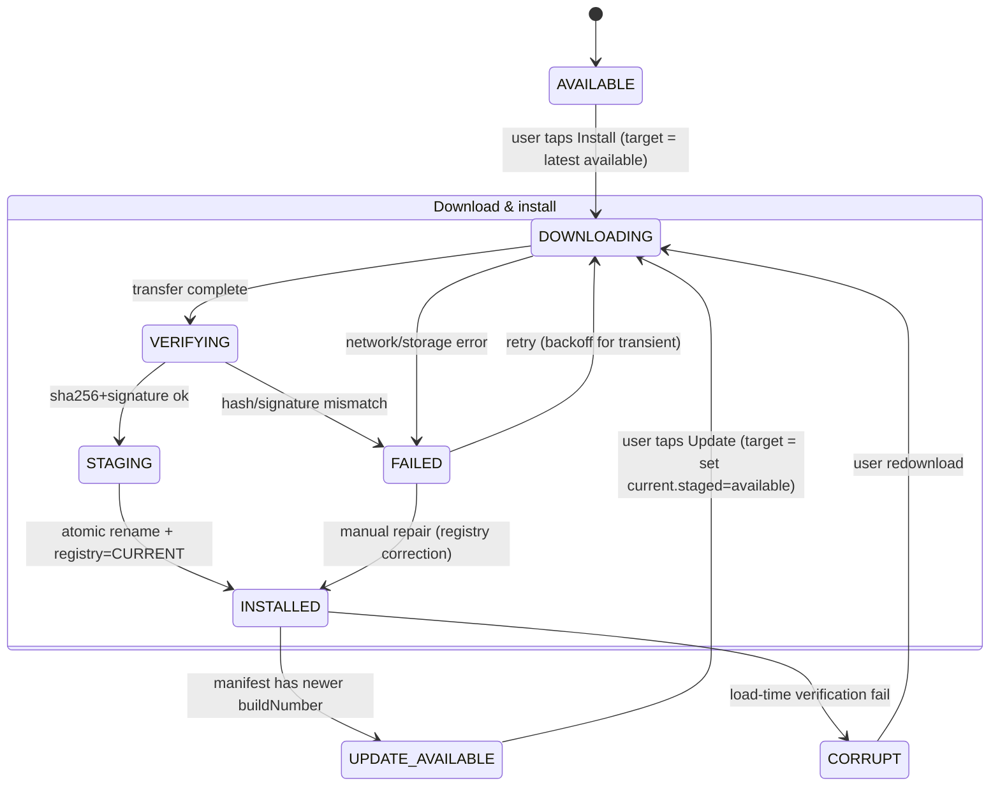
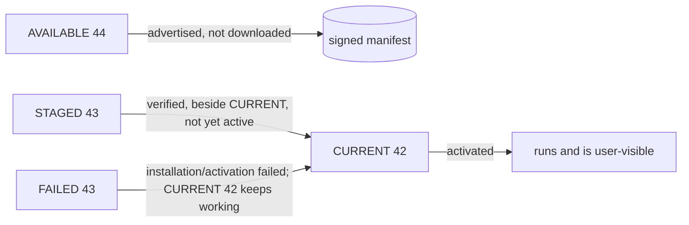

# Plugin Versioning

Status: **DESIGNED** (no implementation yet).

Independent, atomic, monotonic versions for each downloadable tool
(ADR-009, requirement 1, 14, 15).

---

## 1. Version model

Each tool has:

| Term | Meaning | Example |
| --- | --- | --- |
| `buildNumber` | **The** canonical version. Strictly monotonic integer per tool. Comparison/ordering/keying is numeric only. | `42` |
| `displayVersion` | Human label, semver-ish, **decorative**. Never compared. | `"1.7.2"` |
| `toolId` | Stable identifier for one tool producer. | `"image-resizer"` |

Why build numbers over semver as the machine version: no arbitrary resolve-order
rules ("prerelease beats patch?"), trivially comparable, unambiguous directory
keys (`v42`), and free-form labels for humans. Semver is input that publishers
format; the machine only ever sees the manifest's `buildNumber`.

Constraints:

- `buildNumber` is per-`toolId`, assigned by the publisher's release tooling;
  monotonicity is enforced in CI (reject non-increasing).
- A version is **immutable once published** — the same `buildNumber` can never be
  re-uploaded with different bytes. `sha256` in the manifest is the binding
  statement.

## 2. On-disk representation

```
filesDir/plugins/<toolId>/
├── v<buildNumber>/            # one dir per installed version (read-only once placed)
│   ├── dex/classes.dex
│   ├── res/… , resources.arsc, assets/…
│   ├── native/<abi>/…         # FUTURE
│   └── meta/plugin.json
├── downloads/                 # .part files (never loadable)
├── state/                     # host-state.json, plugin-state/, nav-inbox/
├── user-data/                 # durable user data (outside version dirs)
└── cache/                     # evictable
```

`state/`, `user-data/`, `cache/` are **version-independent** (one per tool).
Only the artifact lives in `v<N>/`. This is what makes rollback cheap: point the
registry at another `v<N>`.

## 3. Registry (host source of truth)

A small `DataStore` (or JSON with atomic rename; decision pending in
`docs/decisions.md` ADR-027) recording **per tool**:

```
toolId → {
  currentBuild: 42,
  stagedBuild: 43 | null,
  availableBuild: 44 | null,     // from latest signed manifest
  failedBuild: 43 | null,        // last failed install/activation marker
  state: INSTALLED | UPDATE_AVAILABLE | INCOMPATIBLE | CORRUPT | FAILED | …,
}
```

Additional global fields: last successful manifest check, manifest hash, contract
version of the host that last wrote it.

The registry is written **only after the filesystem state it records is already
true** (rename-before-register), making it monotonic and crash-safe (§5).

## 4. Version state machine



Selected state semantics (requirement 7):

| State | Meaning |
| --- | --- |
| `CURRENT` | The `v<N>` the registry points to; the one activation will use |
| `STAGED` | Fully verified + placed `v<N+1>` sitting **beside** CURRENT; unused yet (kept so a failed activation can roll back) |
| `AVAILABLE` | buildNumber from the signed manifest; not downloaded |
| `FAILED` (`failedBuild`) | The buildNumber that failed install or activation; stored so we don't silently re-try and we can show "your update failed, working version still runs" |

Two user-visible states map from these: `INSTALLED` (quiet CURRENT), plus a
`UPDATE_AVAILABLE` badge whenever `availableBuild > currentBuild`. `STAGED` is
invisible until the user confirms the update.



## 5. Update, activation & rollback (requirements 13, 14)

```
User taps Update for available build K+1:
 1. STAGED := download v(K+1) into downloads/<id>-<k+1>.part
 2. verify sha256 (manifest) + signature (container) + entry safety   [may resume]
 3. unpack → v(K+1).tmp → read-only → atomic rename v(K+1).tmp → v(K+1)
 4. registry: stagedBuild := K+1        (still CURRENT = K)
 5. Activation attempt:
    a. gate (plugin-api.md §6) → fail ⇒ INCOMPATIBLE; STAGED stays; CURRENT untouched
    b. session activate v(K+1) on SUCCESS ⇒ registry currentBuild := K+1, stagedBuild := null
    c. activation/init crash or timeout ⇒ rollback: activate CURRENT K (known-good);
       failedBuild := K+1; STAGED demoted to FAILED-SUPERSEDED
 6. cleanup §6 removes superseded versions
```

Key property: **at no point is CURRENT destroyed before the new version proves
itself** (requirement 13/14). The failure window shrinks to a partial state in
the registry that is repaired by crash recovery (§5.3).

### 5.1 Interrupted download

`.part` + byte offset; resume with HTTP `Range: bytes=N-`; on mismatch restart.
Only a fully verified `.part` is ever renamed into a `v<N>`.

### 5.2 Corrupt download / artifact

Verification failure ⇒ no placement; `failedBuild := N`; previous version intact.
Do **not** trust same-name re-download implicitly: re-verify always.

### 5.3 Crash windows & repair

| Crash point | On restart |
| --- | --- |
| after `.part` written, before rename | `.part` resumed or discarded |
| after `v<N>.tmp` unpack, before rename | `.tmp` deleted (safe, unverified) |
| after rename, before registry.tmp | orphan `v<N>` == what registry expected next ⇒ adopt; else reconcile to STAGED |
| after registry step 4, before activation | `stagedBuild` set, CURRENT still old ⇒ resume activation or roll back |
| after step 7 (CURRENT flip) but before cleanup | CURRENT = new; cleanup runs; no action needed |

Repair order: trust the **registry as intent**, the **filesystem as fact**; where
they disagree, log + choose the state closest to availability (never activate an
unverified file).

## 6. Cleanup (requirement 15)

Retention policy (single device, no prior versions needed):

- Keep: CURRENT, STAGED (if any), and the version that produced the current
  `plugin-state/` until after first successful activation of a successor.
- Keep `.part` only while a download is resumable (≤ 48 h after last progress).
- Delete: superseded `v<N>` (older than CURRENT and not STAGED), orphan `.tmp`,
  stale `.part`, `plugin-state/` snapshots of versions older than the rollback
  retention window.
- Cleanup runs: after successful activation, on process start, and on
  `onTrimMemory`. Never deletes user-data.

Storage budget for plugins overall (shared with the OS / user) is set in
`docs/performance.md` §disk; cleanup is capped by it.

## 7. Background update checking (requirement 12)

- Cadence: on app foreground + ≤ every 6 h; non-blocking; silent on failure.
- Compares per-tool `manifest.lastBuild` vs `currentBuild` only → sets
  `availableBuild` + `UPDATE_AVAILABLE`.
- **Never downloads** (ADR-008); download begins only on explicit user action
  (requirement 13).
- Stale-cache policy: a successfully verified manifest is reused for up to TTL
  (24 h) offline, so the dashboard can still show an update badge without network.

## 8. Compatibility & gating (interplay)

- The gate (`plugin-runtime.md` §6) runs at install **and** activation time using
  gate data from the signed manifest. A version that fails the gate is shown as
  `INCOMPATIBLE`, never offered as `UPDATE_AVAILABLE`/installable.
- Contract evolution (additive `plugin-api` versions) is handled in
  `plugin-api.md` §8; this machine is what enforces the ranges.

## 9. Publisher side (GitHub, FUTURE)

Release tooling increments `buildNumber`, freezes content, computes `sha256`,
signs, tags `tool-<id>-<buildNumber>`, and appends the canonical tool record to
`manifest.json` (protocol in `plugin-runtime.md` §9). Enforcement:

- CI rejects a duplicate/unordered `buildNumber` for the same toolId.
- CI re-computes the sha256 included in the manifest from the exact bytes of the
  release asset (no drift between the two release locations).
- The tool record signature is computed by a key held in CI secrets and verified
  by the pinned host trust store (see `docs/plugin-security.md` §5).